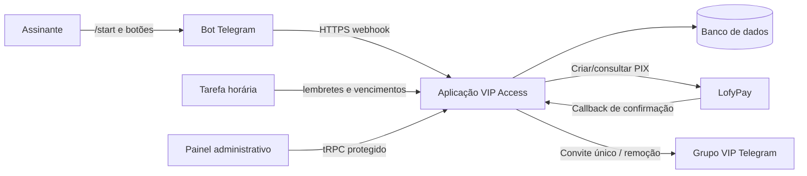

# VIP Access Manager

Plataforma full-stack para vender e administrar assinaturas de acesso a um grupo VIP no Telegram. O projeto combina um bot do Telegram, cobrança PIX pela **LofyPay**, automação de acesso e um painel administrativo web protegido.

> **Uso responsável:** o fluxo foi estruturado para conteúdo permitido exclusivamente a pessoas com 18 anos ou mais. A operação deve respeitar a legislação aplicável, as políticas do Telegram, da LofyPay e os termos do provedor de hospedagem.

## O que foi implementado

| Área | Recursos |
|---|---|
| Bot do Telegram | `/start` com descrição, prévia textual, consentimento de maioridade e botão de assinatura; consulta de planos; status da assinatura; conferência manual de PIX. |
| Cobrança PIX | Geração de cobrança exclusiva por plano; QR/copia e cola enviados pelo bot; validação independente da transação com a LofyPay. |
| Acesso VIP | Convite individual de uso único, com validade de 24 horas; revogação de convite; remoção do grupo no vencimento; preservação do acesso quando existir outra assinatura ativa. |
| Automação | Webhook da LofyPay; webhook do Telegram com segredo; aviso de renovação a três dias do vencimento; rotina horária de expiração. |
| Administração | Visão geral, assinantes, pagamentos, planos editáveis, logs operacionais, webhook e controle de tarefas recorrentes. |
| Segurança | Consentimento +18 gravado; proteção de administrador; callbacks com token individual; validação de valor, referência, tipo e status de PIX; processamento idempotente. |

## Arquitetura resumida



## Configuração para produção

### 1. Telegram

Crie o bot por meio do **BotFather**, guarde o token com segurança e adicione o bot ao grupo VIP como administrador. Ele precisa das permissões para **criar links de convite** e **remover/restringir membros**. Em seguida, informe o identificador numérico do grupo privado.

| Variável | Finalidade |
|---|---|
| `TELEGRAM_BOT_TOKEN` | Token do bot criado no BotFather. |
| `TELEGRAM_GROUP_CHAT_ID` | ID numérico do grupo VIP; normalmente inicia com `-100`. |
| `TELEGRAM_WEBHOOK_SECRET` | Segredo aleatório usado no cabeçalho de atualização do Telegram. |

Após publicar o projeto, acesse **Operação → Configurar webhook** no painel. Esse procedimento registra a URL pública `/api/webhooks/telegram` no Telegram de forma segura.

### 2. LofyPay

Configure a chave de API da LofyPay. A aplicação gera uma URL de callback exclusiva para cada cobrança PIX, contendo um token de uso interno. O callback não é considerado suficiente por si só: a aplicação consulta a transação na LofyPay e só concede o acesso quando valor, referência, identificador, tipo `DEPOSIT` e status `COMPLETED` forem confirmados.

| Variável | Finalidade |
|---|---|
| `LOFYPAY_API_KEY` | Chave privada da API da LofyPay. |

### 3. Painel e automações

O painel usa a autenticação já integrada ao projeto. A conta proprietária é administradora por padrão. Após a publicação do projeto, acesse **Operação → Ativar automação** para criar a tarefa horária que dispara lembretes e processa vencimentos. A tarefa só é ativada em ambiente publicado, evitando chamadas externas acidentais durante o desenvolvimento.

## Ordem de entrada em operação

1. Publique o projeto a partir da interface de gerenciamento após criar um ponto de controle.
2. Confirme a URL pública do aplicativo.
3. Configure o bot como administrador do grupo e confirme `TELEGRAM_GROUP_CHAT_ID`.
4. No painel, revise os preços e a duração em **Planos**.
5. Em **Operação**, configure o webhook do Telegram e ative a automação.
6. Faça uma compra PIX real de baixo valor e valide a entrega de convite, a entrada no grupo e o registro no painel.

## Planos iniciais

O banco inicia com os planos editáveis abaixo. Atualize nomes, valores e descrições antes de abrir vendas, se necessário.

| Plano | Duração | Valor inicial |
|---|---:|---:|
| Plano Mensal | 30 dias | R$ 29,90 |
| Plano Trimestral | 90 dias | R$ 79,90 |

## Comandos do bot

| Comando | Resultado |
|---|---|
| `/start` | Exibe descrição, prévia, aviso +18 e confirma a maioridade antes da compra. |
| `/planos`, `/assinar`, `/renovar` | Lista planos ativos após consentimento +18. |
| `/minha_assinatura` | Informa o estado e a validade do acesso atual. |

## Desenvolvimento e validação

```bash
pnpm check
pnpm test
pnpm build
```

Os testes abrangem cálculo de validade, prevenção de duplicidade de pagamento, retenção de acesso quando aplicável e validação da liquidação PIX.

## Personalização da mensagem `/start`

O texto de apresentação e a prévia são definidos em `server/services/bot.ts`, na função `sendStart`. Para inserir uma prévia visual, use a API `sendPhoto` do Telegram em um fluxo adicional e armazene quaisquer imagens de forma compatível com a política de conteúdo e a legislação local.

## Observações operacionais

* Nunca exponha tokens de bot, chaves da LofyPay, QR codes ou links de convite em páginas públicas.
* O convite é limitado a uma entrada e tem validade de 24 horas; um reenvio revoga o convite anterior.
* A remoção do grupo só ocorre se não houver outra assinatura ativa válida para o mesmo usuário.
* Os registros de auditoria permitem analisar falhas de callback, envio de convite, expiração e ações administrativas.
